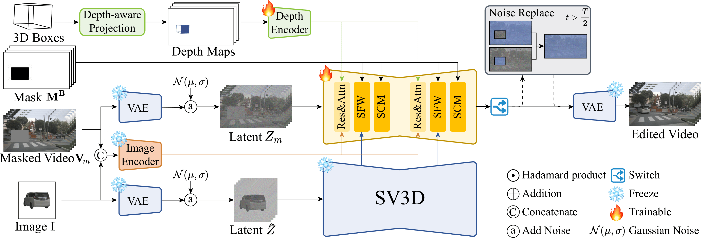

# RecEdit-Drive
This is the official code repository for our CVPR 2026 paper:
3D Reconstruction-Guided Spatiotemporal Video Editing for Autonomous Driving Scenes


<br/>

## Installation
```sh
conda create -n RecEdit_Drive python=3.10 -y
conda activate RecEdit_Drive
pip install torch==2.1.1 torchvision==0.16.1 xformers==0.0.23 --index-url https://download.pytorch.org/whl/cu118
pip install -r requirements.txt
pip install .
pip install -e git+https://github.com/Stability-AI/datapipelines.git@main#egg=sdata  # install sdata for training
```

## Use This model
We provide a gradio demo for editing driving scenario videos.
```sh
python interactive_gui.py
```

## Train the model
To train the model, execute the following command:
```sh
python main.py -b configs/train.yaml --wandb --enable_tf32 True --no-test
```
